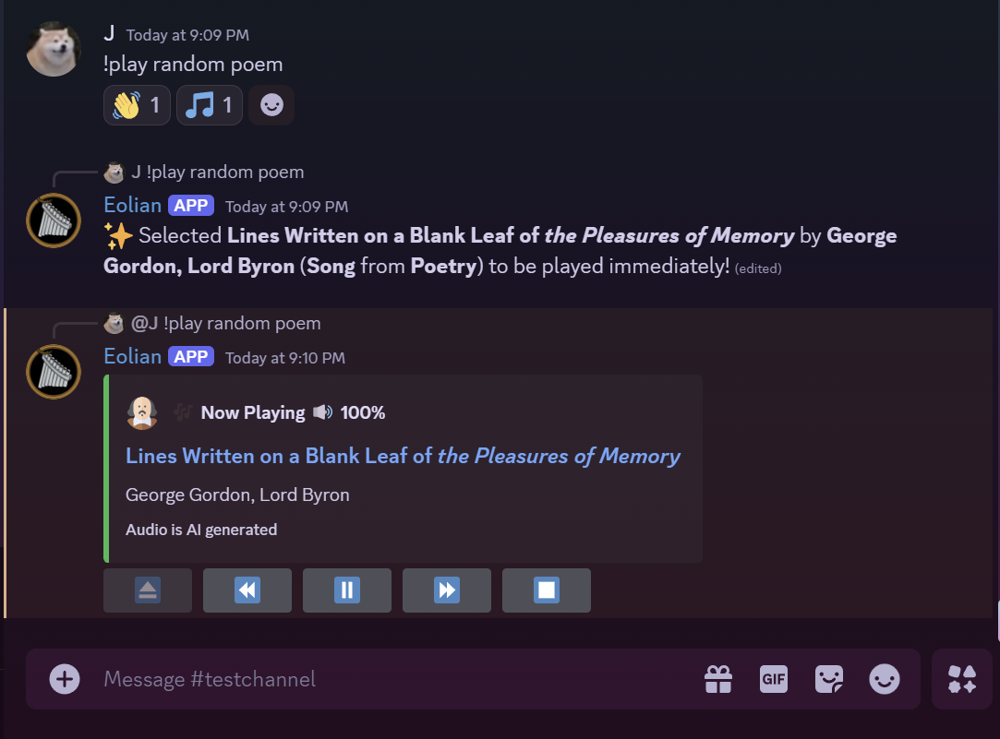
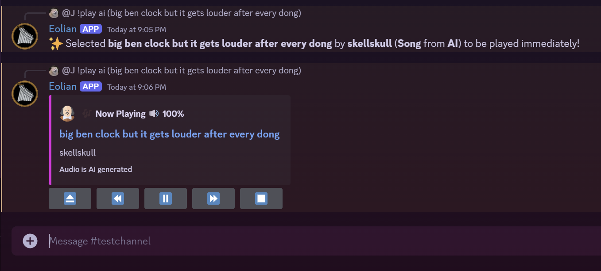
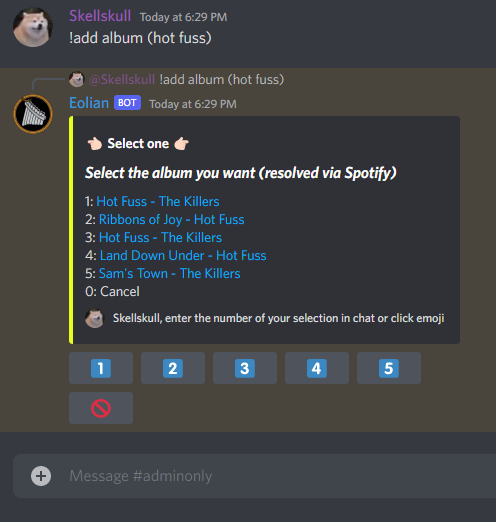
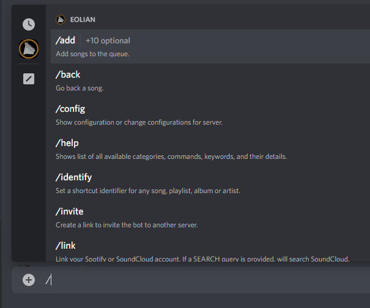
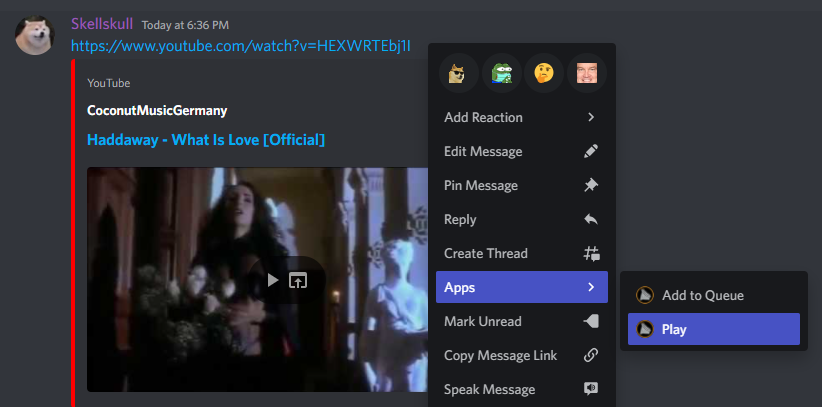
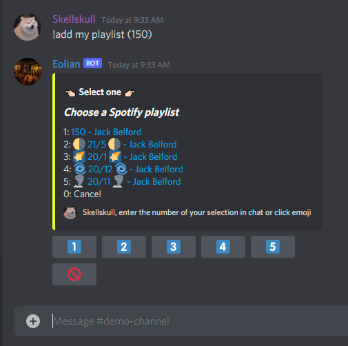
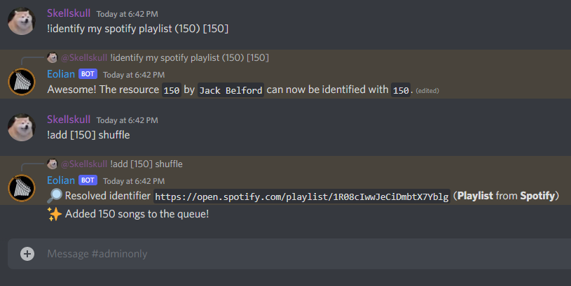

# Eolian / ShuffleBot2

Eolian is a Discord music bot that aims to be easy to use and provide a very powerful API for queuing songs from a variety of sources such as entire albums, playlists, artist discography, and more.

This is successor for my older project [ShuffleBot](https://github.com/jbelford/ShuffleBot) which was most known for it's emoji button interactable player and support for Spotify playlists.

# [📩 Invite Link](https://discord.com/api/oauth2/authorize?client_id=900529540839899138&scope=bot+applications.commands&permissions=3665216)

> Click the link to invite the bot directly

# [🧪 Test Discord Server](https://discord.gg/pzD6UyrCTn)

> You can try out the bot at this server

# 🎇 Features

## 🧠 (NEW) OpenAI Generated Audio

### Poetry Text to Speech

Sit back and relax as Eolian reads you a poem

### Spoken Sound Effects

Prompt for an AI-spoken language sound effect to add that humorous touch to every voice call!

## 🔎 Search Anything

You can add any type of resource to the queue. Here is the list of each type of resource and where they can be fetched from using this bot.

| Type         | Spotify | SoundCloud | YouTube | Poetry | AI  |
| ------------ | ------- | ---------- | ------- | ------ | --- |
| Albums       | ✅      | N/A        | N/A     | N/A    | N/A |
| Songs        | ❌\*    | ✅         | ✅      | ✅     | ✅  |
| Playlists    | ✅      | ✅         | ✅      | N/A    | N/A |
| Artists      | ✅      | ✅         | ❌      | N/A    | N/A |
| Likes        | ✅\*\*  | ✅         | N/A     | N/A    | N/A |
| Top Tracks   | ✅\*\*  | N/A        | N/A     | N/A    | N/A |
| Live Streams | N/A     | N/A        | ✅      | N/A    | N/A |

* Songs searched from Spotify will default to YouTube 
** Spotify likes and top tracks are not public. Supported when SPOTIFY_OAUTH is configured.

## 🎮 Easy To Use Buttons

This bot takes every opportunity to simplify usage through the use of modern Discord buttons.

## 🗣 Keyword Based Command Syntax

The syntax for commands allows you to very specifically search and queue up tracks.

Below are two very simple examples of this in action. See this repo's Wiki for further detail about all the available options and how this works.

_Note: Optionally may reconfigure bot to use flag-based syntax if preferred. See the wiki_

## 💬 Integrates with Slash Commands

Slash command support has also been added to this bot!

**Older users may need to re-invite the bot to apply updated authentication scopes required by the bot**

_On **April 22 2022** Discord will require bots on 75 servers or more to be verified in order to receive message content. On this date Slash commands will become the required interaction._

## 🖱️ Message Quick Actions

Quickly add or play a song by simply right clicking on a message!

## 🔗 Link Spotify and SoundCloud Accounts

You can link a Spotify and/or SoundCloud account to your profile. This allows you to query your own public tracks / likes / playlists.

Here is an example of searching my own public playlists on Spotify.

## 💾 Save Shortcuts to your favorite albums, playlists or more!

You can create an "identifier" to any URL or search result. These allow you to quickly queue up the songs found at that resource much quicker in the future!

In the above example, I created an identifier `150` which points to my Spotify playlist also named `150`. 
Now I can add the songs from this playlist to the queue by simply providing the identifier when calling `!add`. 
I also include the `shuffle` keyword which will shuffle these songs before adding them to the queue.

## 🚀 Performance Improvements

Music playback has been greatly optimized over ShuffleBot and songs will transition with less delay.
