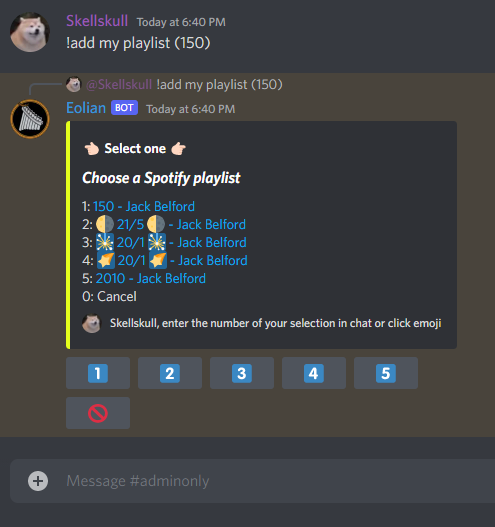

# Eolian / ShuffleBot2

Eolian is a Discord music bot that aims to be easy to use and provide a very powerful API for queuing songs from a variety of sources such as entire albums, playlists, artist discography, and more.

This is successor for my older project [ShuffleBot](https://github.com/jbelford/ShuffleBot) which was most known for it's emoji button interactable player and support for Spotify playlists.

# 🚧 Under Construction

This bot is still actively being improved and updates are being pushed frequently.
Expect bugs and bot may suddenly restart without warning as updates are pushed.

# 📩 Invite Link

https://discord.com/api/oauth2/authorize?client_id=600199818387914752&permissions=1077411136&scope=bot

# 🧪 Test Discord Server

You can try out the bot at this server

https://discord.gg/4BMkBHWT

# 🎇 Features

## 🔎 Search Anything

You can add any type of resource to the queue. Here is the list of each type of resource and where they can be fetched from using this bot.

| Type | Spotify | SoundCloud | YouTube |
| ---- | ------- | ---------- | ------- |
| Albums | ✅ | N/A | N/A |
| Songs | ❌* | ✅ | ✅ |
| Playlists | ✅ | ✅ | ✅|
| Artists | ✅ | ✅ | 🚧 |
| Likes | ❌** | ✅ | N/A |

* Songs searched from Spotify will default to YouTube 
** Spotify likes are not public

## 🎮 Easy To Use Buttons

**NEW** No more emoji reactions!

This bot takes every opportunity to simplify usage through the use of modern Discord buttons

## 🗣 Keyword Based Command Syntax

The syntax for commands allows you to very specifically search and queue up tracks.

Below are two very simple examples of this in action. See this repo's Wiki for further detail about all the available options and how this works.

_Note: Optionally may reconfigure bot to use flag-based syntax if preferred. See the wiki_

## 🔗 Link Spotify and SoundCloud Accounts

You can link a Spotify and/or SoundCloud account to your profile. This allows you to query your own public tracks / favorites / playlists.

Here is an example of searching my own public playlists on Spotify.

## 💾 Save Shortcuts to your favorite albums, playlists or more!

You can create an "identifier" to any URL or search result. These allow you to quickly queue up the songs found at that resource much quicker in the future!

In the above example, I created an identifier `150` which points to my Spotify playlist also named `150`. 
Now I can add the songs from this playlist to the queue by simply providing the identifier when calling `!add`. 
I also include the `shuffle` keyword which will shuffle these songs before adding them to the queue.

## 🚀 Performance Improvements

Music playback has been greatly optimized over ShuffleBot and songs will transition with less delay.

# 🚧 Tutorial / How to Use

Tutorial on how to use will be added to the Wiki and is currently under construction